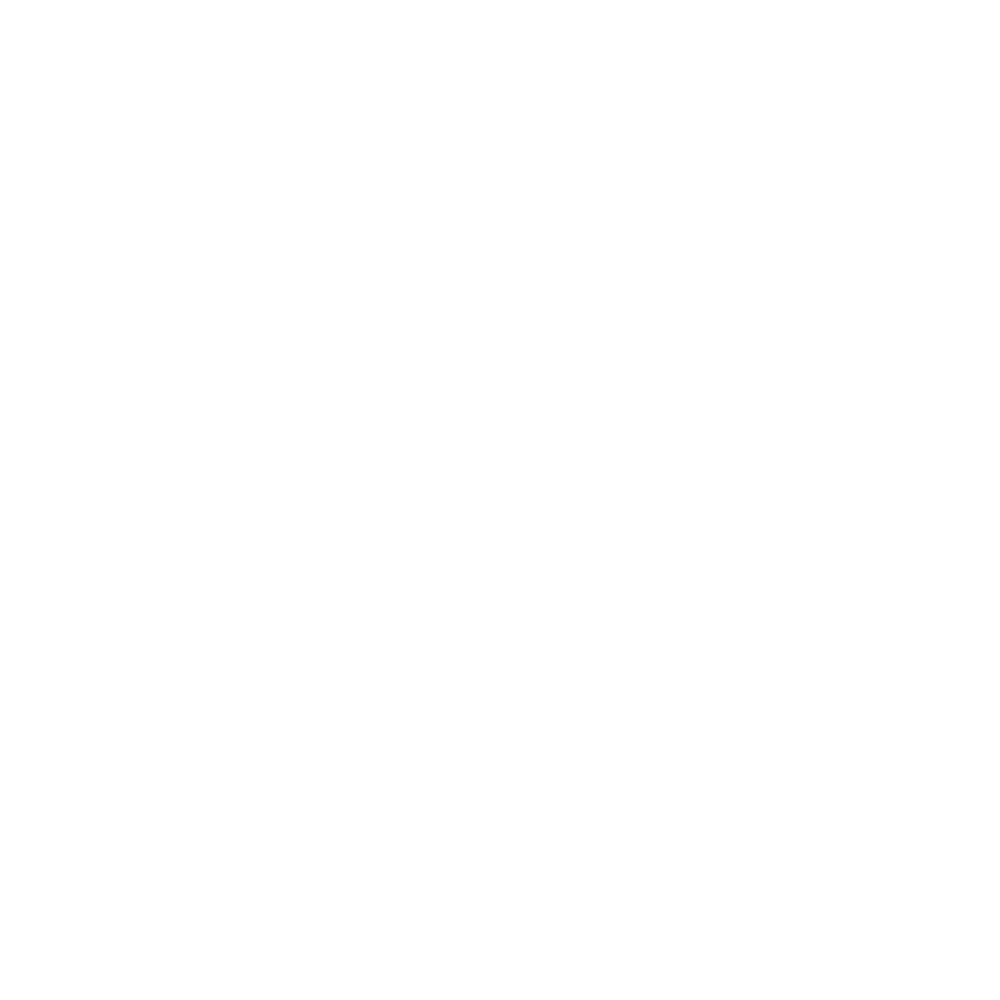

<p align="center">
  
</p>
<h1>Meet the Mind<br> Behind the Code:<br> Who I Am and What I Do</h1>
<p align="justify"> My name is Stefan Bartl (Steve) and I'm glad you're here. I mainly focus on TypeScript, Web-Development in general (WebAssembly, Web-IDL, SASS, Web-Security, Browsers, Infrastructure,...),
 and "some C/C++". In my spare time, i fiddle around with newer languages like ZIG, Go or Rust or get hands on "close to the hardware" topics like x86-64 Assembly- or Linux-Kernel-Development. I share my achievements on LinkedIn and Google Drive, and you'll find the links below in the `WKDSteve` object.

I'm still in training and look forward to any kind of exchange. Feel free to reach out, and we can chat on Discord about the wonderful world of information technology! I'm also interested in the maker scene, specifically 3D printing, and I'm a proud owner of an entry-level model from [*Bambu Lab*](https://eu.store.bambulab.com/en-at/products/a1-mini).

**One important note:**
Access to technology should be a given for everyone, but unfortunately, it is not. It is unevenly distributed and, despite its central importance, still not freely accessible. Our data is being collected daily, even now, often without our knowledge or consent, raising critical concerns about privacy and security.</p>
<p>We must advocate for transparency and control over how our information is used!</p>
<p>Get organized!</p>

```ts
                                          /* Shape of me */
interface CodingSkillz {
    hoursSpentCodingLastMonth?: number;
    favoriteEditor?: string;
    languageRatings?: Map<string, string>;
    interpretersAndCompilers: number;
    yearsOfExperience: number;
    securityTools: ReadonlyArray<string>;
    latestVulnerability: string;
    skillz: string[] | null;
    certificates?: string[];
    currentlyLearning?: string[];
}

const wkdMood = Symbol("🍮");
export interface WKD extends CodingSkillz {
    mood: typeof wkdMood;
    getActualMood: () => string
    nickname: string;
    contact: string;
}

                                          /* Actual me... */
const WKDSteve: WKD = {
    nickname: "l.value",
    contact: "l.value.impl@gmail.com",
    mood: wkdMood,
    getActualMood: () => WKDSteve.mood.description,
    printActualMood: () => console.log(WKDSteve.mood.description)
    hoursSpentCodingLastMonth: 130,
    favoriteEditor: "nvim",
    languageRatings: new Map([
        ['typescript', 'Nice!'],
        ['c++', 'Just love it, really.'],
        ['lisp', 'Nice for theory and learning.'],
        ['rust', 'Gold, but newbie.'], 
    ]),
    interpretersAndCompilers: 14,
    yearsOfExperience: 3,
    skillz: null,
    certificates: [
        `Look at my LinkedIn: www.linkedin.com/in/Stefan-Bartl`,
        `Look at my XMIND-RoadMap: https://xmind.ai/share/k2PSPlst`
    ],
    currentlyLearning: ['Nest.js as a whole', 'apply TypeScript', 'awk', 'Windows Administration'],
    securityTools: ['Wireshark', 'HackRfOne', 'Metasploit', 'Soldering iron'],
    latestVulnerability: `Got caught when I didn't lock the screen 3 times when I was was working for a customer.`,
};
```

<br>
<p align="left">
  <a href="mailto:l.value.dev@gmail.com" alt="Outlook">
  </a>
</p>  
<a href="https://www.linkedin.com/in/stefan-bartl/" target="_blank">🔗 LinkedIn</a>
<br>
<a href="https://discord.gg/JfpgmJ3A" target="_blank">🔗 Discord</a>
<br>
<a href="https://stefanbartl.vercel.app/de" alt="Portfólio">🔗 my portfolio website</a>
